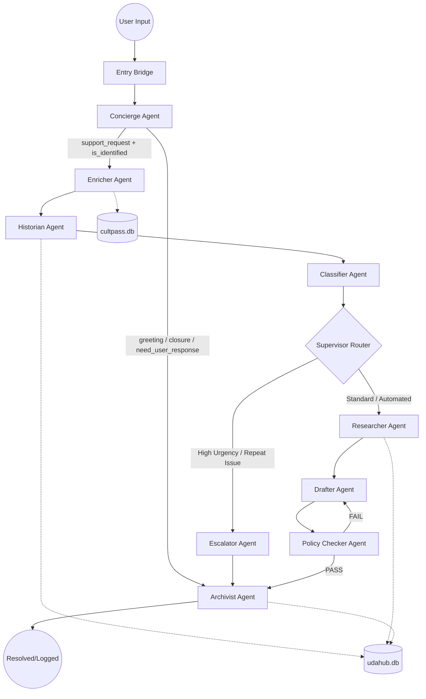

# UDA-Hub Multi-Agent Architecture Design (Updated)

This document outlines the refactored architecture for the UDA-Hub Agentic Customer Support System. The system now follows a Concierge-First model to maximize efficiency and data integrity.

## 1. System Overview

The UDA-Hub system utilizes a Directed Acyclic Graph (DAG) with an Identity Gatekeeper at the entry point. The architecture enforces a strict separation between social interactions (Greetings/Closures) and authenticated support workflows requiring database access.

## 2. Visual Diagram (Mermaid)

## 3. Agent Roles & Responsibilities

| Agent | Responsibility | Key Input | Key Output |
|---|---|---|---|
| Concierge | Acts as the "Front Desk." Handles triage and enforces the Identity Gate. | ticket_text, messages | triage_intent, is_identified, ai_response |
| Enricher | Authenticates the user by querying the user and subscription tables. | user_email / name | user_id, customer_tier, subscription_status |
| Historian | Retrieves "Durable Memory" by scanning past tickets for recurring issues. | user_id | user_history, is_recurring, similar_ticket_id |
| Classifier | Specialist node identifying technical domains (Billing, Tech, Account). | ticket_text | support_category, urgency |
| Researcher | Retrieves grounded facts from the internal Knowledge Base. | support_category | research_facts, retrieval_confidence |
| Drafter | Synthesizes history and research into an empathetic response. | research_facts, user_history | ai_response |
| Policy Checker | Audits drafts for compliance against official company policy. | ai_response, research_facts | policy_grade (PASS/FAIL) |
| Archivist | Finalizes the turn by logging the interaction and updating metadata. | ai_response, status | archive_summary, status |

## 4. Information Flow & Decision Making

### A. The Identity Gate (Refactored)

The Concierge replaces the old Clarifier/Greeter/Closer nodes.

- **Rule:** If the user has a problem but provides no ID, the Concierge handles the response immediately.
- **Rule:** The "Heavy Path" (Enricher, Historian, Researcher) is only accessed if `is_identified` is `True`.

### B. Durable Memory (Historian)

The system now leverages the `udahub.db` `ticket_messages` and `tickets` tables to check for persistence.

- If a similar unresolved issue is found, the Supervisor bypasses automation and routes to the Escalator for human intervention.

### C. State Hygiene

The `entry_bridge` continues to ensure turn-based accuracy by resetting temporary flags (`policy_grade`, `research_facts`) while preserving `messages` for long-term context.

## 5. Implementation Strategy

- **Database Mapping:** Enricher maps to `cultpass.db` (User/Subscription info). Historian and Researcher map to `udahub.db` (Tickets/Knowledge Base).
- **Linear Efficiency:** The `classifier_node` no longer handles social chatter, allowing for higher precision in technical support classification.