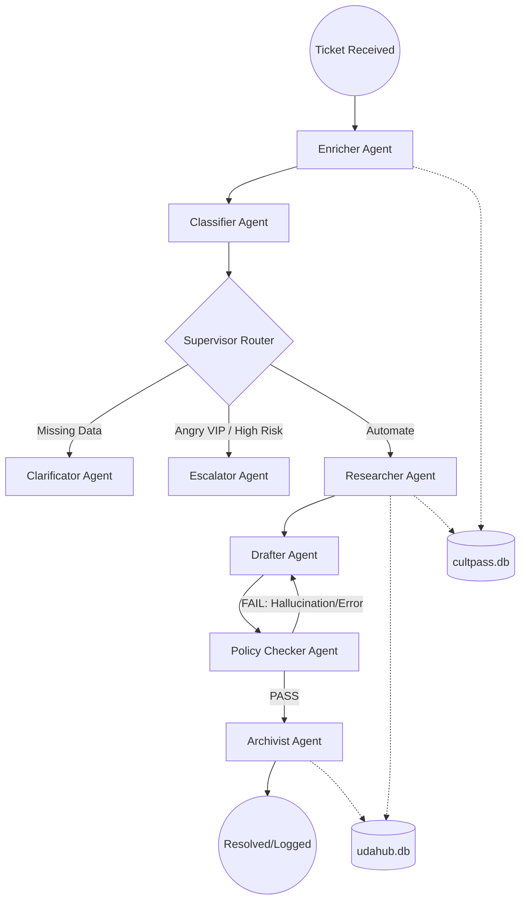

# UDA-Hub Multi-Agent Architecture Design

This document outlines the architecture for the UDA-Hub Agentic Customer Support System, a multi-agent assembly line built on LangGraph. The system is designed to handle support tickets by enriching user data, classifying intent, researching facts across multiple databases, and drafting compliant, empathetic responses.

## 1. System Overview

The UDA-Hub system utilizes a Directed Acyclic Graph (DAG) with self-correction loops to process customer inquiries. Unlike a single monolithic chatbot, this architecture breaks the problem into specialized roles, ensuring that data retrieval, policy enforcement, and brand voice are handled by distinct, optimized agents.

## 2. Visual Diagram (Mermaid)

## 3. Agent Roles & Responsibilities

| Agent | Responsibility | Key Input | Key Output |
|---|---|---|---|
| Enricher | Authenticates the user by matching email/ID against the database. | user_email | user_id, customer_tier, status |
| Classifier | Identifies the intent (Billing, Tech, Account) and assesses urgency. | ticket_text | category, urgency, confidence |
| Clarifier | Requests missing information from the user if identity is unknown. | category | ai_response (request for info) |
| Escalator | Hands off high-risk or angry VIP tickets to human agents. | urgency | ai_response (escalation notice) |
| Researcher | Queries SQLite databases to find specific bookings and policies. | user_id, query | research_facts (bulleted list) |
| Drafter | Writes the final empathetic response based on facts and user tier. | research_facts | ai_response (email draft) |
| Policy Checker | Audits the draft for hallucinations or policy violations. | ai_response | policy_grade (PASS/FAIL) |
| Archivist | Summarizes the interaction and logs metadata to the core DB. | ai_response | archive_summary, DB Entry |

## 4. Information Flow & Decision Making

### A. The "Gatekeeper" Flow (Supervisor Router)

The system uses a logic-based router after the Classification stage.

- **Logical Condition:** If `urgency == "high"`, the system immediately diverts to the Escalator.
- **Security Condition:** If `category == "billing"` but `user_id` is null, it diverts to the Clarifier.
- **Default:** Otherwise, it triggers the Researcher to begin automation.

### B. The Research-Validation Loop

This is the "Brain" of the system.

- **Fact Gathering:** The Researcher uses SQL tools to pull data. It outputs raw facts.
- **Synthesis:** The Drafter turns raw facts into a natural language response.
- **Audit:** The Policy Checker acts as a "Legal Department." It compares the Draft against the Facts.
- **Feedback Loop:** If the Policy Checker finds a promise (e.g., a refund) that isn't in the facts, it sends the state back to the Drafter with specific correction instructions.

## 5. Input Handling & Expected Outputs

### Input Types

- **Standard Query:** "I forgot my password."
  - Path: Enricher → Classifier → Researcher → Drafter → QA → Archivist.
- **Unauthorized Sensitive Request:** "Give me a refund," sent from an unregistered email.
  - Path: Enricher (Fail) → Classifier (Billing) → Supervisor → Clarifier.
- **High Urgency/VIP:** "I'm a Premium member and I'm stranded at the airport!"
  - Path: Enricher (Premium) → Classifier (High Urgency) → Supervisor → Escalator.

### Expected Outputs

- **Successful Automation:** A professional email drafted in the UDA-Hub brand voice, confirmed against official policies, and logged in the database.
- **Clarification Request:** A polite request for the user to provide their account email.
- **Internal Metadata:** Updated `ticket_metadata` in `udahub.db` with tags (e.g., `#refund_denied`, `#tech_resolved`).

## 6. Implementation Strategy

- **State Management:** LangGraph `UDAHubState` (TypedDict) acts as the single source of truth.
- **Persistence:** `MemorySaver` (Checkpointer) allows the system to pause for clarification and resume exactly where it left off once the user provides missing data.
- **Safety:** The Policy Checker uses a temperature of `0.0` to ensure strict adherence to provided facts.