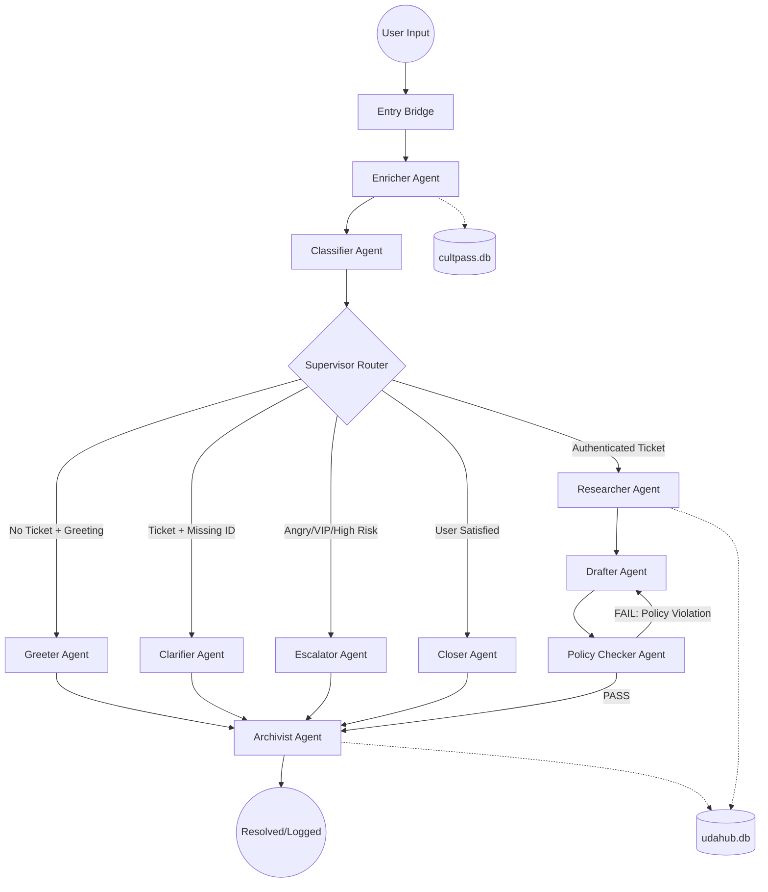

# UDA-Hub Multi-Agent Architecture Design

This document outlines the architecture for the UDA-Hub Agentic Customer Support System, a multi-agent assembly line built on LangGraph. The system is designed to handle support tickets by enriching user data, classifying intent, researching facts across multiple databases, and drafting compliant, empathetic responses.

## 1. System Overview

The UDA-Hub system utilizes a Directed Acyclic Graph (DAG) with Dynamic Anchoring and self-correction loops. The architecture treats every interaction as a turn-based progression through specialized nodes, ensuring that security (Identity Gates) and quality (Policy Audits) are never bypassed.

## 2. Visual Diagram (Mermaid)

## 3. Agent Roles & Responsibilities

| Agent | Responsibility | Key Input | Key Output |
|---|---|---|---|
| Enricher | Mines history for Name/Email/ID and queries cultpass.db. | messages, latest_input | user_id, customer_tier |
| Classifier | Identifies intent and preserves the "Ticket Anchor." | messages, latest_input | category, ticket_text |
| Greeter | Handles pleasantries when no active ticket is present. | user_name | ai_response |
| Clarifier | Politely requests missing identification details. | ticket_text, messages | ai_response, status: pending_user |
| Escalator | Hands off high-risk/VIP tickets to human managers. | urgency, ticket_text | ai_response, status: pending_human |
| Researcher | Queries SQLite to find bookings and relevant policies. | user_id, ticket_text | research_facts |
| Drafter | Synthesizes research into an empathetic email draft. | research_facts, tier | ai_response |
| Policy Checker | Audits the draft for policy compliance/hallucinations. | ai_response, facts | policy_grade (PASS/FAIL) |
| Closer | Finalizes the interaction when a user is satisfied. | messages | ai_response, status: closed |
| Archivist | Tool-based agent that logs summaries to udahub.db. | ai_response, user_id | archive_summary, DB Entry |

## 4. Information Flow & Decision Making

### A. The "Anchor Shield" (Hijack Protection)

The Supervisor uses the `ticket_text` (Anchor) to prevent context switching.

- **Rule:** If `ticket_text` is populated, a greeting classification is ignored, and the user is kept in the identification or research loop.
- **Rule:** If `user_id` is found mid-conversation (via the history-aware Enricher), the user is immediately promoted to the Researcher.

### B. The Identity Gate

The Archivist acts as the final gatekeeper for data integrity.

- **Condition:** If `user_id` is null, the Archivist bypasses the database write to prevent "anonymous clutter" in the production logs.
- **Exception:** High-urgency escalations may be archived even without a `user_id` to provide context for human agents.

### C. The Satisfaction Loop

The system monitors for satisfaction or gratitude intents (e.g., "Thanks, that works!").

Once detected, the Supervisor routes to the Closer, which sets the state `status` to `closed`, signaling the Archivist to seal the ticket record in the database.

## 5. Input Handling & Expected Outputs

### Input Types

- **The "Alice" Scenario (Interrupted ID):** "Refund?" → "I need your email." → "I'm Alice."
  - Path: Clarifier → User Input → Enricher (Finds ID) → Supervisor (Sees ID + Anchor) → Researcher.
- **The "Polite Closure" Scenario:** "Thanks for the help, goodbye!"
  - Path: Classifier (Satisfaction) → Supervisor → Closer → Archivist (Status: Closed).
- **The "Ghost" Interaction:** A bot saying "Hello" repeatedly.
  - Path: Classifier (Greeting) → Greeter → Archivist (Identity Gate Bypass) → END.

## 6. Implementation Strategy

- **History Awareness:** All extraction nodes (Enricher, Classifier) scan the `messages` list rather than just the latest string to ensure context is never lost.
- **Tool Separation:** Database SQL logic is isolated into standalone `@tool` functions, allowing the Agents to remain model-agnostic and easily testable.
- **State Hygiene:** The `entry_bridge` node resets turn-specific flags (`policy_grade`, `research_facts`) to ensure each turn starts with a clean slate while preserving the conversation memory.